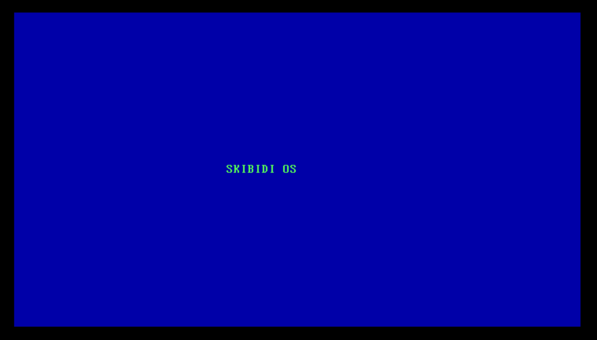

# Skibidi OS
_An Operating System for the truly Ascended_  

Skibidi OS is a brand new OS that does nothing new feature wise. It's only purpose in life is to serve as a learning experience for it's creator, and act as reference for fellow beginners who are stuck midway in development or for ultra noobs with extreme skill issues get started on building an OS

## Features
* **Zero security**
* Microkernel that does the bare minimum **(When it wants to) (and when it's been implemented)**
* Very minimal **(actually zero)** support for every existing software **(write it yourself noob)**

# Tl;dr
You really do have the attention span of a goldfish. Anyhow: **USELESS OS, BUT IT WORKS SO REFER FROM IT**

## Screenshots
